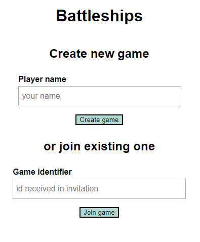
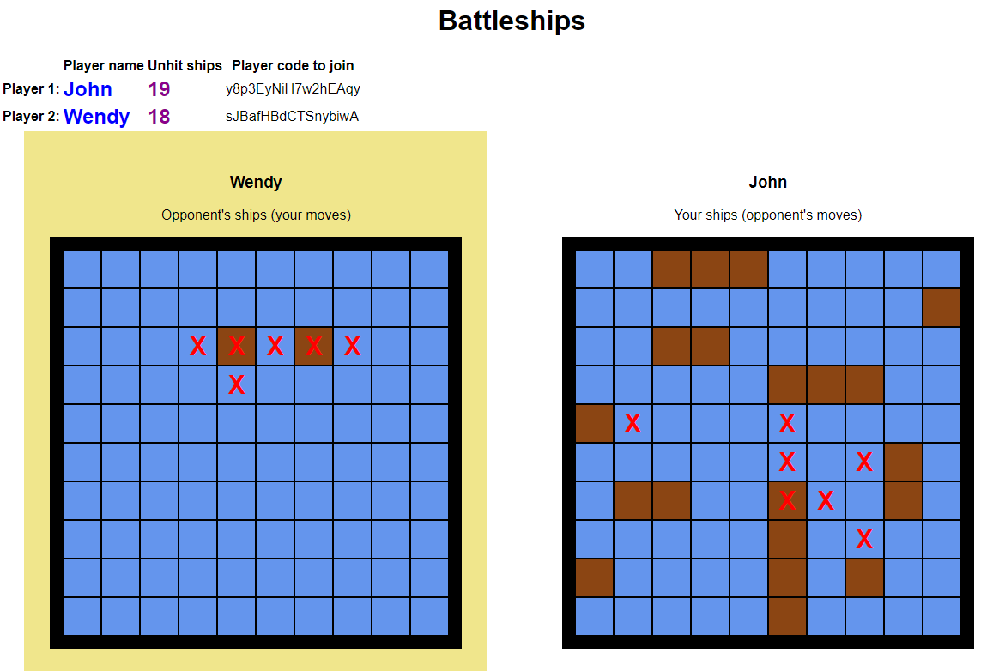

# Tech stack

# Battleships
Classic battleships game, 2 players.

At the start you can either 
- start a new game by providing your player Name
- join existing game by providing code from the player, who started the gain
  

Code to join is available for both players 
(so if you close your browser you can still re-join the game if the other player will give you the code).

Codes are re-generated each time player joins the game. If you use other player's code to log in as him and see his
ships - it won't be unnoticed, as your opponent will be logged out upon code re-generation.

## Gameplay

The board on the left belongs to your opponent. Shoot, discover and sink his ships!

The board on the right is yours, you can track your opponents shots.

The board highlighted with yellow is the one, were next move takes place.
### Enjoy